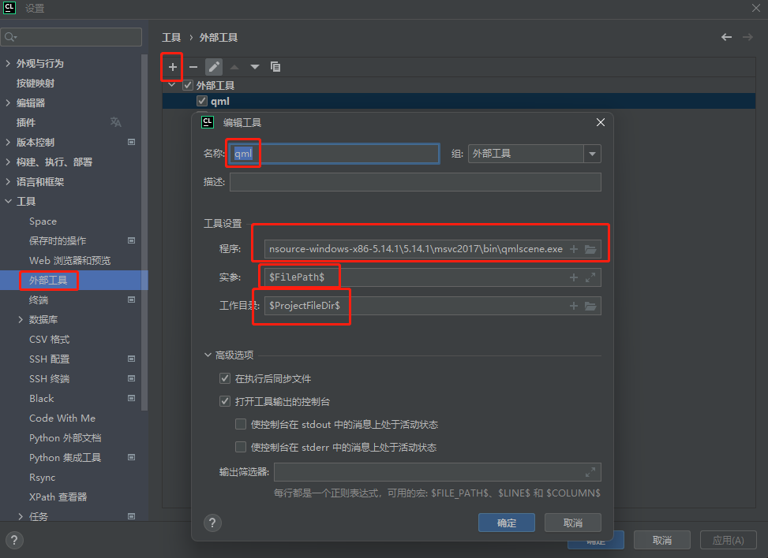
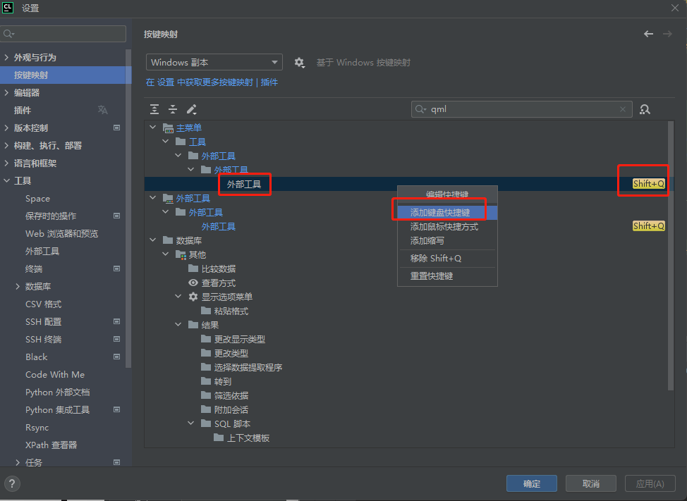

# qq5_test

## 1 、 qt5.14 静态编译文件
链接：https://pan.baidu.com/s/1z2i3iyizwTJV8PigAfZXcA?pwd=4k8w
提取码：4k8w

## 2 、 静态编译文件使用方式
1) 见主目录CmakeLists.txt
```c++
set(CMAKE_PREFIX_PATH ".../qt-opensource-windows-x86-5.14.qt_ui_test/qt-opensource-windows-x86-5.14.qt_ui_test/5.14.qt_ui_test/msvc2017")
```
2) clion配置编译器

> vs2019社区版，添加vs工具链，；
> 
>设置>工具链>架构： amd64_x86；

## 3 、 qt配置相关

### (1). QDebug不能输出控制台
>编辑配置>环境变量添加 ： QT_ASSUME_STDERR_HAS_CONSOLE=1

### (2). Qt designer保存的ui文件生成.h文件使用方式
1 )准备工作
> 将ui文件复制进项目根目录下的uic文件夹

>在根目录tool文件夹内打开cmd，执行下面命令
```c++
./uic.exe xxx.ui -o xxx.h
```
2 ) 新建类生成测试弹窗
```c++
#include "xxx.h"   //必须添加 "ui_类名.h" 头文件
#include <QDialog>
class testUi:public QDialog,public Ui::Form
{
    Q_OBJECT  //添加 Q_OBJECT宏，为ui类提供信号槽机制
public:
    testUi()
    {
        setupUi(this); //ui类的构造函数中必须包含启动函数，可将代码与界面关联起来。
    }
    ~testUi() override=default;
};
```
3 ) 测试弹窗
```c++
testUi* p = new testUi();
p->show();
```
### (3)qml+qtQuick使用注意
>example

1）配置文件需加入
```c++
find_package(Qt5 COMPONENTS
        Core
        Gui
        Widgets
        Quick
        QuickWidgets
        REQUIRED)
target_link_libraries(qt_test
        Qt5::Core
        Qt5::Gui
        Qt5::Widgets
        Qt5::Quick
        Qt5::QuickWidgets
)
```
2)qml路径需要加入系统环境变量


3)注意QtQuick版本，可以在qtcreator里面新建qt quick项目查看


4)qml引入路径要加上`qrc`
```c++
qquickWidget_ = new QQuickWidget;
QUrl source("qrc:/resource/qml/listen.qml");
qquickWidget_->setResizeMode(QQuickWidget::SizeRootObjectToView);
qquickWidget_->setSource(source);
```
5)预览qml文件
>*a.在根目录tool文件夹内点击qmlscene.exe，选择对应的qml文件*
> 
>*b.快速预览  配置外部工具*

> 
>*c.配置快捷键*

> 
>*d.在编辑qml时直接按shift+q即可实时看到qt界面*